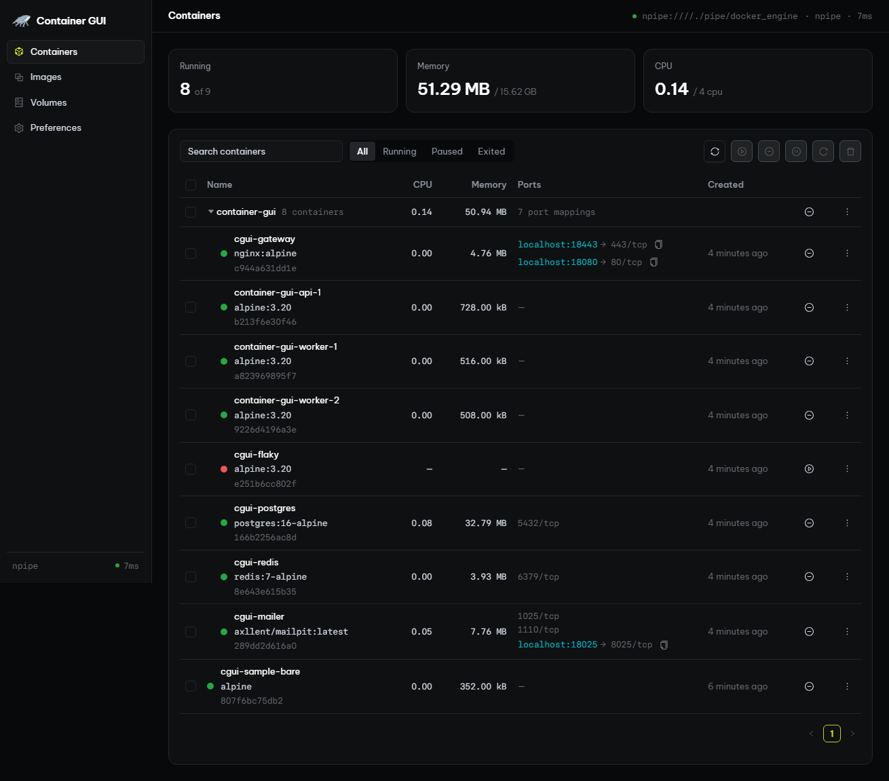
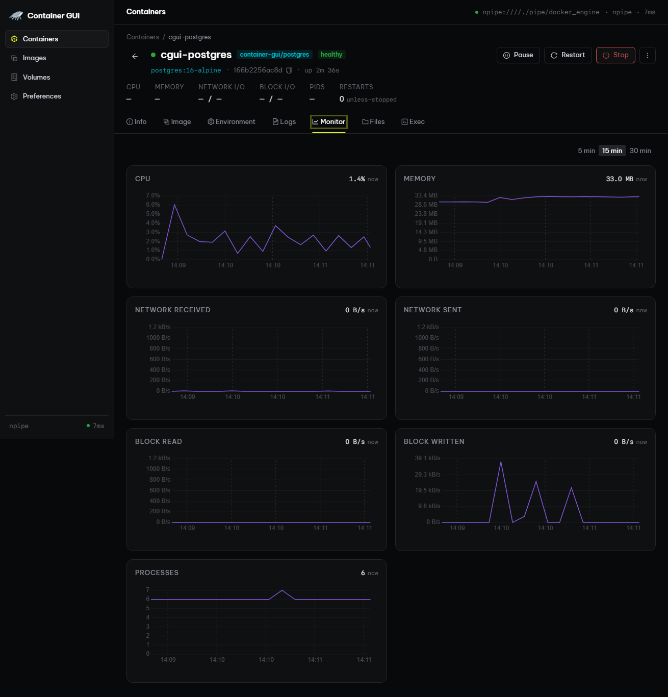
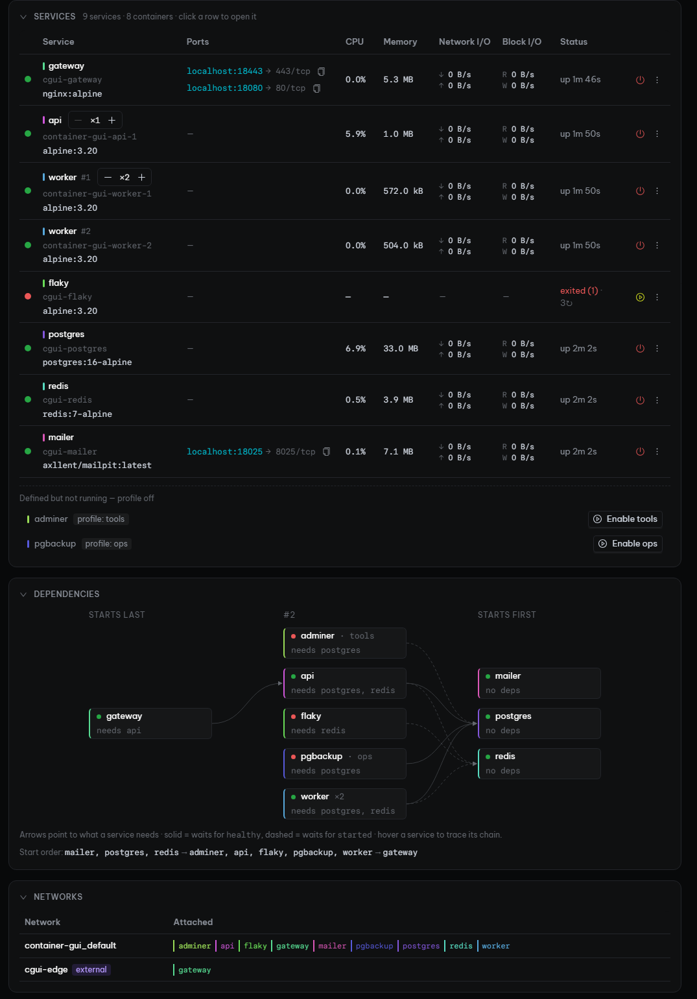
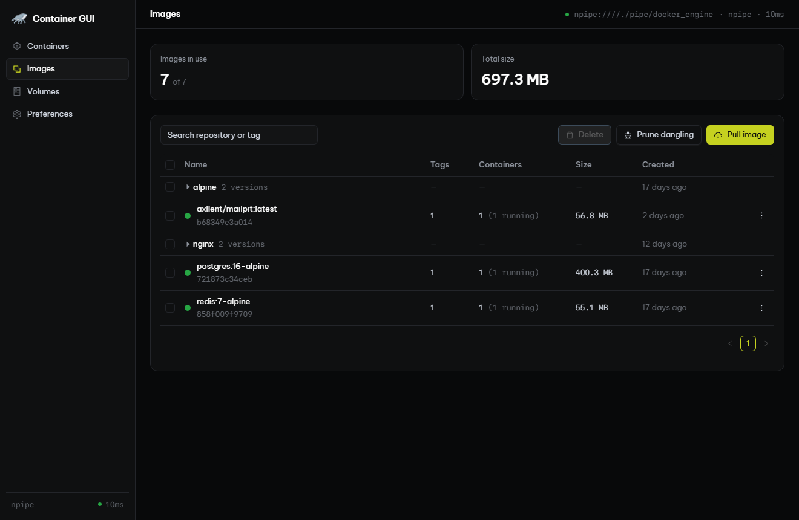
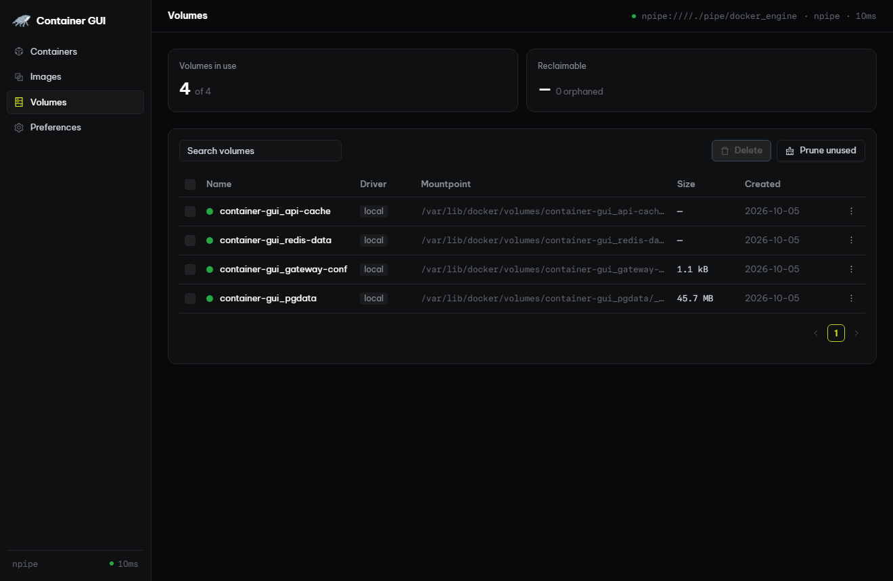

# Container GUI

A fast, native desktop app for managing Docker containers, Compose projects,
images, and volumes. Built with [Tauri 2](https://tauri.app), React, and
[Ant Design](https://ant.design).



## Features

### Containers

- Containers grouped by Compose project, with live CPU, memory, and port mappings.
- Start, stop, pause, restart, and remove, one at a time or in batches; rows show a
  spinner while an action runs.
- Container detail tabs: **Info**, **Image**, **Environment**, **Logs** (search,
  level filter, follow, export), **Monitor**, **Files**, and **Exec** (interactive
  terminal).



### Compose projects

- One page per project: services, replica scaling, profiles, networks, and mounts.
- Dependency graph showing start order and `depends_on` conditions.
- Aggregated logs, monitoring, and the merged Compose config.



### Images

- Images grouped by repository, with tag count, size, and the containers using each one.
- A colored dot shows usage: green if a running container uses the image, amber if
  only stopped containers do, grey if unused.
- Pull, tag, delete, view layer history, and prune dangling images.



### Volumes

- A dot shows whether each volume is mounted or orphaned; hover for the container count.
- Volume detail page with Docker-reported size, driver, options, labels, and the
  containers that mount it.
- Volumes in use can't be deleted, and deleting asks for confirmation. Prune removes
  every orphaned volume at once.



## Install

Download the Windows installer from the
[latest release](https://github.com/KafkaWannaFly/container-gui/releases/latest).
You need a running Docker Engine, such as Docker Desktop.

Once installed, the app checks GitHub Releases for a newer version at startup
and can install it in place; you can also check manually under
**Preferences → About**.

## Development

Prerequisites: [Node.js](https://nodejs.org) with [pnpm](https://pnpm.io),
[Rust](https://rustup.rs), GNU Make, and Docker.

```sh
make i        # install frontend and backend dependencies
make dev      # run with hot reload, dev icons, and the "(Dev)" window title
make test     # type-check the frontend and run backend tests
make lint     # lint the frontend (Biome) and the backend (Clippy)
make pub-win  # build the signed Windows NSIS installer with release icons
```

Releases are built by `.github/workflows/release.yml` when the version in
`src-tauri/tauri.conf.json` changes. It signs the updater artifacts with the
`TAURI_SIGNING_PRIVATE_KEY` repository secret and publishes `latest.json`, which
installed apps poll for updates. `make pub-win` expects the same key at
`~/.tauri/container-gui.key` (override with `TAURI_SIGNING_PRIVATE_KEY`). Keep a
backup of the key: without it, existing installs cannot be updated.

Sample data for manual testing:

```sh
make up       # a standalone container plus the `container-gui` Compose project
make profiles # also enable the `tools` and `ops` profiles
make down     # remove everything created above
```

### Recommended IDE setup

[VS Code](https://code.visualstudio.com/) with the
[Tauri](https://marketplace.visualstudio.com/items?itemName=tauri-apps.tauri-vscode) and
[rust-analyzer](https://marketplace.visualstudio.com/items?itemName=rust-lang.rust-analyzer) extensions.